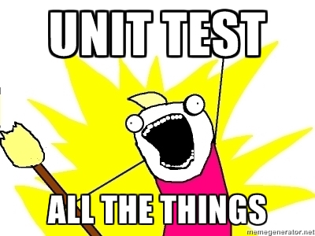
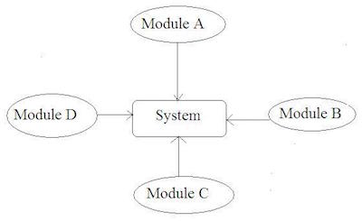

# UNIT & INTEGRATION TESTING
## UNIT TESTING
<p align="center"></p>

### Definition
Unit testing is a method of **testing individual units of code** to check whether or not they are fit for use. The **tests** are **short** pieces of **code** created **specifically** for this.

Depending on the specific type of programming being done **what a unit is can** actually **vary**. In most cases it can be viewed as the smallest piece of testable code but this is not always the case.

In object-oriented programming, for example, **a unit could be** an entire interface like **a class**. Ideally each test case would be separate from each other and you could substitute data in if needed to help when testing. For example **a mock object** could be used over a real object to help keep things controlled and to help make sure the code code works in the intended manor.

### UNIT TEST EXAMPLE
### The code (to be tested)
````javascript

function example() {
  return "example";
}
````
### The unit test

````javascript
test( "Example test", function(assert) {
  var actual = example();
  assert.equal(actual, "example", "Passed!" );
  ````

### Unit test template
````javascript
test("Example unit test", function(assert) {
var testInputs = something...
var actual = funcUnderTest(testInputs);
var expected = something else...
assert.equals(actual, expected, "Success message")
});
````


## INTEGRATION TESTING

<p align="center"></p>

### Definition
Integration testing is to **test the collaboration of multiple units** (that have hopefully been **unit tested already**) and is the phase after unit testing. The purpose of this is to check things like **performance**, **functionality** and **reliability**.

## PROS & CONS OF UNIT TESTING

<p align="center"></p>

<table align="center">
    <th style="font-size:24">PROS</th>
    <th style="font-size:24">CONS</th>
    <tr>
        <td>**Find bugs** more easily. <span style="color='green';font-weight='bold'">Green</span>/<span style="color='green';font-weight='bold'">Red Lights!!</span></td>
        <td> **time consuming**, high set-up time in TDD.</td>
    </tr>
    <tr>
        <td>**Isolates bugs**, otherwise a nightmare during integration, **and gives confidence** to the project team **that the code works**.</td>
        <td>Only tests for **anticipated bugs**.</td>
    </tr>
    <tr>
        <td>**Forces** developer to **separate modules** from dependencies.</td>
        <td>May be **hard to separate modules**.</td>
    </tr>
    <tr>
        <td>**Provides clarity** about what the code needs to do.. **and** unit tests can also be considered as **documentation**.</td>
        <td>Requires a **learning curve**. You could be unproductive for a while.</td>
    </tr>
    <tr>
        <td>**Forces thinking** about the code to write.</td>
        <td style="border-bottom=none"></td>
    </tr>
    <tr>
        <td>**Facilitates** code **refactoring**</td>
        <td style="border-top=none"></td>
    </tr>
<table>


### INTEGRATION TESTING

<p align="center"></p>

<table align="center">
    <th style="font-size:24;color='green';">GENERAL PROS</th>
    <th style="font-size:24";color='red';>GENERAL CONS</th>
    <tr>
        <td>Tests interfaces and **bugs not catched at unit level**.</td>
        <td>**Time consuming**</td>
    </tr>
    <tr>
        <td>**Provides confidence** to the project team.</td>
        <td>Steep **learning curve**</td>
    </tr>
<table>

### Types of Integration Testing

##### Big Bang (e.g. Usage / Model Testing)
Developed modules are coupled together to form a **complete software system** to test.
**All components** are thus integrated at the **same time**.
<p align="center"></p>

<table align="center">
    <th style="font-size:24;color='green';">GENERAL PROS</th>
    <th style="font-size:24";color='red';>GENERAL CONS</th>
    <tr>
        <td> Late integration allowed.</td>
        <td> **Difficult to trace origin of bugs**.</td>
    </tr>
    <tr>
        <td></td>
        <td>**Time** consuming</td>
    </tr>
<table>

##### Bottom Up Testing
Lowest level components tested first, up to the highest-level component.
<p align ="center"></p>

<table align="center">
    <th style="font-size:24;color='green';">GENERAL PROS</th>
    <th style="font-size:24";color='red';>General Cons</th>
    <tr>
        <td>**Thorough**</td>
        <td>**Time** consuming</td>
    </tr>
    <tr>
        <td>Test conditions are **easier to create**.</td>
        <td>**Need** to create **all bottom modules** first.</td>
    </tr>
    <tr>
        <td>**Observation** of test results is **easier**.</td>
        <td></td>
    </tr>
<table>

##### Top Down Testing
Highest level components tested first, down to the lowest-level component.
<p align ="center"></p>

<table align="center">
    <th style="font-size:24;color='green';">PROS</th>
    <th style="font-size:24";color='red';> CONS</th>
    <tr>
        <td>Provides early outline, allowing to **spot design flaws early**</td>
        <td>**Cost**. Re-testing required once bottom modules are added.</td>
    </tr>
    <tr>
        <td>Advantageous **if bugs occur toward the top** of the program.</td>
        <td></td>
    </tr>
    <tr>
        <td>Easier to find a **missing branch link**.</td>
        <td></td>
    </tr>
<table>

##### Sandwich Testing
Mixing top-down and bottom-up testing.
<p align ="center"></p>

##### Risky - Hardest
The **riskiest / hardest** module is **tested first**.

### Integration Test Example (template)
````javascript
test("Example integration test", function(assert) {
// ObjectOne interacts with ObjectTwo via "someMethod"
var a = new ObjectOne();
var b = new ObjectTwo();
// configure object b
b.parameter = something...

// pass b to the interface
a.someMethod(b);

// assert that "a" has been modified as expected
assert.equals(a.someProperty, expectedProperty);
assert.equals(a.someOtherProperty, expectedOtherProperty);
});
````

## READ MORE
* [Unit testing](https://en.wikipedia.org/wiki/Unit_testing)
* [Integration testing](https://en.wikipedia.org/wiki/Integration_testing)
* [Types of integration testing](http://www.softwaretestingstuff.com/2007/10/top-down-testing-vs-bottom-up-testing.html)
* <a href="https://msdn.microsoft.com/en-us/library/aa292128(v=vs.71).aspx">Overview</a>
* [Types of integration testing](http://www.cs.nuim.ie/~fying/PDF/slidescs265.pdf)
* [Big Bang integration testing](http://istqbexamcertification.com/what-is-big-bang-integration-testing/)
