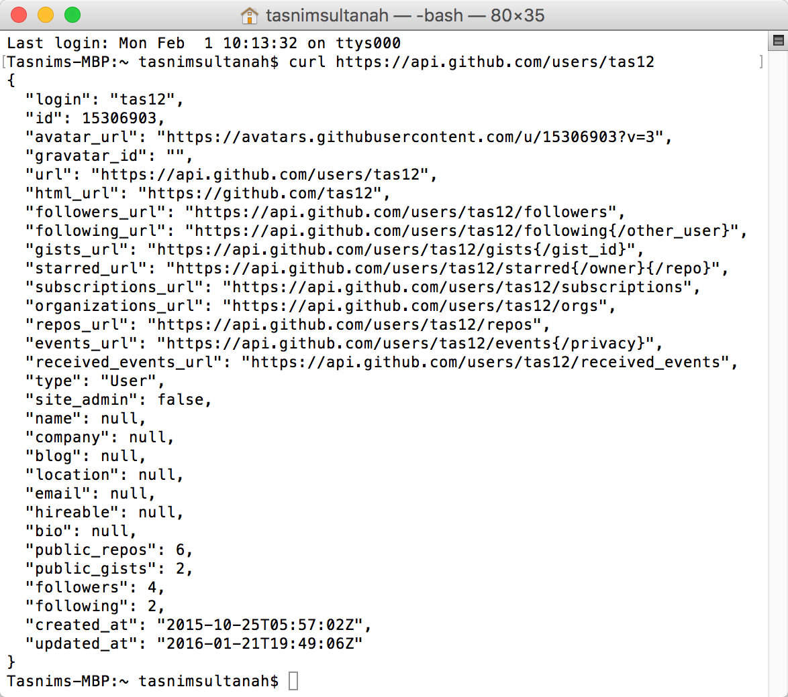
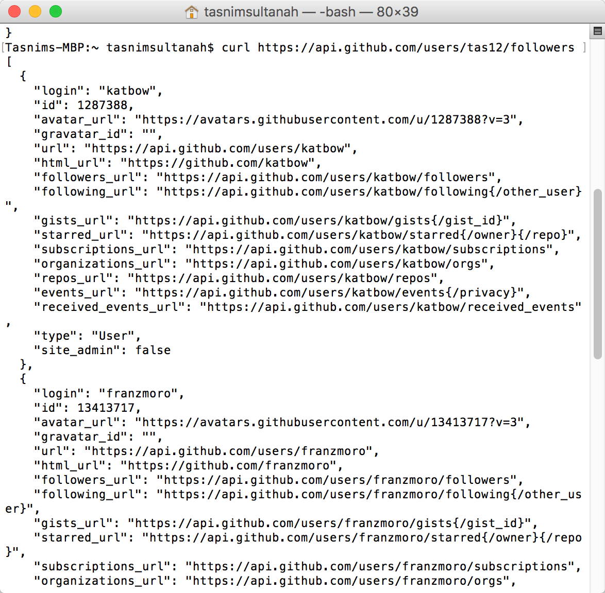
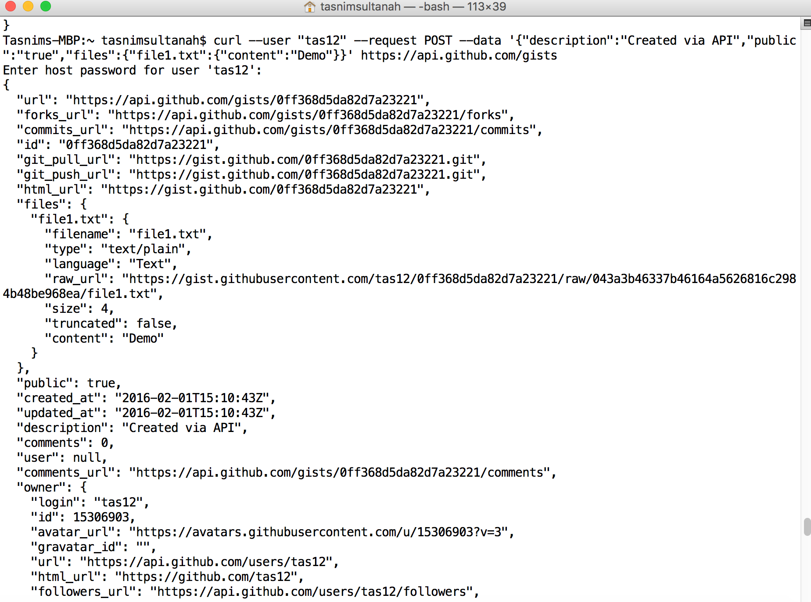
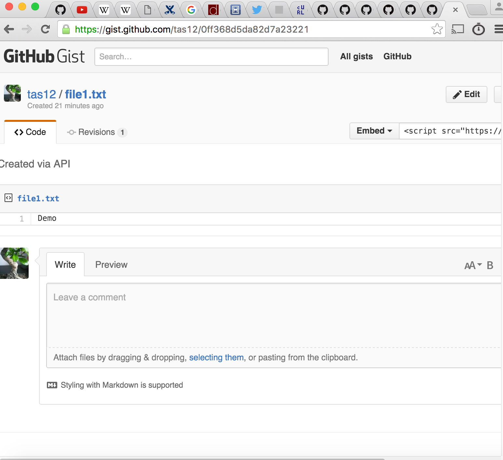

# cURL

## What is the core functionality of curl?

cURL is a command line tool for transferring data between client and server. It uses URL syntax.

Data transfer is done using protocols such as HTTP and FTP.

## How can curl be used to query APIs?

### Get data from a GitHub API:

This command returns information on a specified GitHub user in the form of a JSON object.
```
curl https://api.github.com/users/username
```


You can append a key name to the end of the url to get more information on the key. E.g. 'followers' is a key in the JSON object returned from the previous command. Adding this to the end of the url gives more information on followers

```
curl https://api.github.com/users/followers
```



### Login via the command line using cURL

1. Create a public access token here https://github.com/settings/tokens

2. Enter the following command to login to your GitHub account using your token

curl -u username:token https://api.github.com/user

### Post data to GitHub:

POST: sends new information to the specified source

Example using cURL to create a new Gist:

curl --user "user" --request POST --data '{"description":"Created via API","public":"true","files":{"file1.txt":{"content":"Demo"}}' https://api.github.com/gists





## Other commands

PUT: updates existing information of the specified source
DELETE: removes existing information from the specified source

## Installation

It is likely that cURL is already installed on your machine. If not, you can use the following command for Mac:

```
$ brew install curl
```
