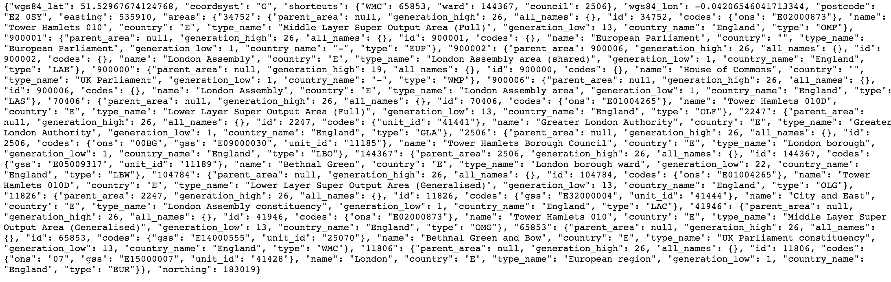
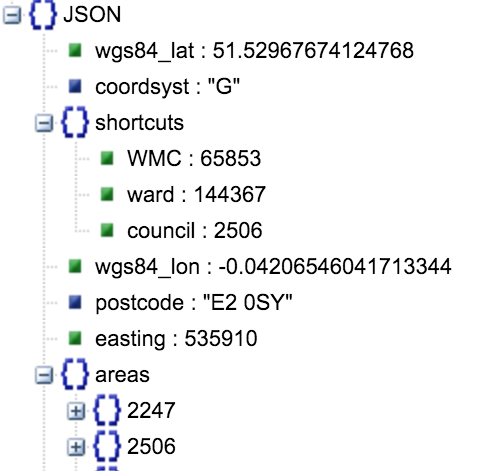

# JSON-API TUTORIAL

### 1. TAKE A LOOK AT SERVER DATA
It can look very ugly!! And you still want to get an idea of what data you can retrieve! 


There are two options to make it readable:
* View object structure by copy-pasting the text into [here](http://jsonviewer.stack.hu/)

* Beautify the format using a [beautifier](http://jsbeautifier.org/)
```json
{
    "wgs84_lat": 51.52967674124768,
    "coordsyst": "G",
    "shortcuts": {
        "WMC": 65853,
        "ward": 144367,
        "council": 2506
    },
    "wgs84_lon": -0.04206546041713344,
    "postcode": "E2 0SY",
    "easting": 535910,
    "areas": {
        "34752": {
        }
    }
}
```

### 2. GET JSON DATA FROM SERVER
To get the readable data, you have to make a request in your script as follows:

##### Create a request object
```javascript
var request   = new XMLHttpRequest();
```
#### Open and Send Request.
```javascript
request.open("GET","http://mapit.mysociety.org/postcode/E20SY",false);
// GET method will retrieve data.
// The request will be synchronous if false and asynchronous if true.
request.send();
```
#### Create a function that runs if the request is ready and available.  
```javascript
request.onreadystatechange = function() {
    if (request.readyState == 4 && request.status == 200) {
        // request finished and response is ready; 200: "OK"
        var response        = JSON.parse(request.responseText);
        // convert the response string into JSON, saving it as a variable.
```
#### Create an accessible variable / object to store the responseText
This is handier than calling ```request.onreadystatechange()``` every time we want to access data.

In the code below, we achieved this by creating an empty object, ```obj```, and allowing the function to write key-value pairs from the JSON ```response```  into ``obj``.

#### CODE SO FAR
```html
<p></p>
<script>
    var request   = new XMLHttpRequest(),
        obj       = {};

    request.onreadystatechange = function() {
        if (request.readyState == 4 && request.status == 200) {
            var response        = JSON.parse(request.responseText);
                obj.lat         = response.wgs84_lat;
                obj.long        = response.wgs84_lon;
                obj.country     = response.areas[34752].country_name;
                obj.postcode    = response.postcode;
        }
    }

    request.open("GET","http://mapit.mysociety.org/postcode/E20SY",false);
    request.send();

    document.querySelector("p").innerHTML =
        "We are currently in: "+obj.country+".<br>"+"Coordinates are  "+obj.postcode+" "+obj.lat+":"+obj.long;

</script>
```

#### 2. USE JSON DATA
At this point all the data is stored as key-value pairs in ```obj``` and you can access the values as if it were a regular JS object. Such values can be accessed and added to HTML like so:
```javascript
document.querySelector("p").innerHTML =
        "We are currently in: "+obj.country+".<br>"+"Coordinates are  "+obj.postcode+" "+obj.lat+":"+obj.long;
```
It will open up in the [browser](examples/ex2.html) like this.

## REFERENCES
 * JSON read/write helpers (**so useful!**):
    * [format JSON in readable format](http://jsbeautifier.org/)
    * [read JSON online](http://jsonviewer.stack.hu/)

<
