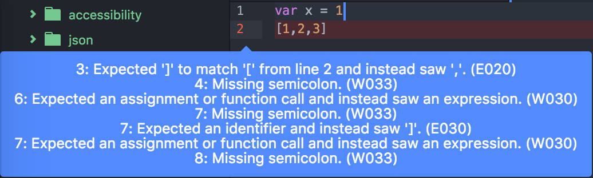

# Linter

Linter is a municipality located in the Belgian province of Flemish Brabant.

Alternatively, a linter is also a piece of software that performs static analysis of code (typically within a text editor or IDE) in order to flag up likely errors and problems with syntax. Some linters, particularly those bundled with some IDEs, also flag code that contravenes best practices or style conventions.

This is obviously useful, as it eliminates many bugs that would perhaps be undiscovered until runtime, and also can help to enforce style conventions and other best practices.

If you are using Atom as a text editor, many linters can be installed as packages. Try [jshint](https://atom.io/packages/jshint). Other linters may be built on top of the base atom [linter](https://atom.io/packages/linter).

#### Example

Above is an example of jshint in operation. Invalid JS syntax is highlighted, with explanations of why and a reference to which "rule" is being broken.
