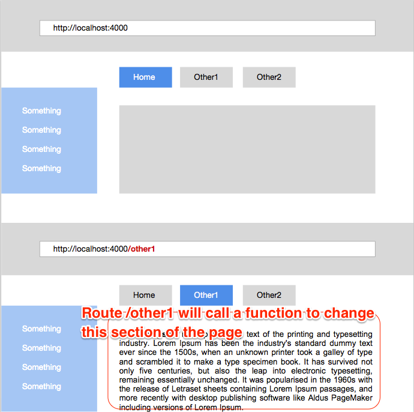

# The Ultimate Node Routing Walk-through


### In a nutshell...
A router is a separate .js file that selects the most appropriate handler function to respond to the client's request.

Look at the diagram below to understand the router's role. Instead of loading a separate file each time the user requests new content, the router can modify the root URL, which calls the handler function responsible for the requested content.




### Follow these simple steps to create your own router...

You are going to create 4 separate .js files or modules that will work together.

* Create a ```handler.js``` file. This includes all the handler functions your app will use to respond to requests.

```javascript
function home(request, response) {

}

// + any other handlers in charge of your app's features
```
* Remember to include a module exporter. This will allow your other three files to access your handler functions if they require the ```handler.js```module.

```javascript
module.exports = {
    'home' : home
    // add one name/value pair per handler
}
 ```

* Create a separate ```routing.js``` file. This will require the ```handlers.js``` module.

```javascript
var handlers = // require the handlers module here
```

* Create a function within the same module that determines which handler is required by the request.

```javascript
function router(/*which parameters do you need?*/) {

    // which handler are you going to run? It should depend on the request made by the user.
}
```

* Don't forget to include your module exporter!

* Create a separate ```server.js``` file. This will require Node.js' core ```http``` module ([check out the documentation for more info](../).

```javascript
var http = // require the http module
```

* Create a function that creates a server.

```javascript
function server(app, port) {
    // Create server here. Hint: remember the http module?
}
```

* Once again, you need a module exporter!

* Finally, create your separate ```app.js``` file. This will require both your ```routing.js``` and your ```server.js``` modules.

```javascript
var server = // require server here
var routing = // require routing here

```

* Initialise your server using your ```router``` function (in your ```routing.js``` module) and a port (e.g. 3000).

* Run your app in your terminal with node:
```node
node app.js
```

* Check your browser to see your app in action. Make sure you are point to the right server.

e.g. http://localhost:3000

* Check your routes are giving you the response you expect!
