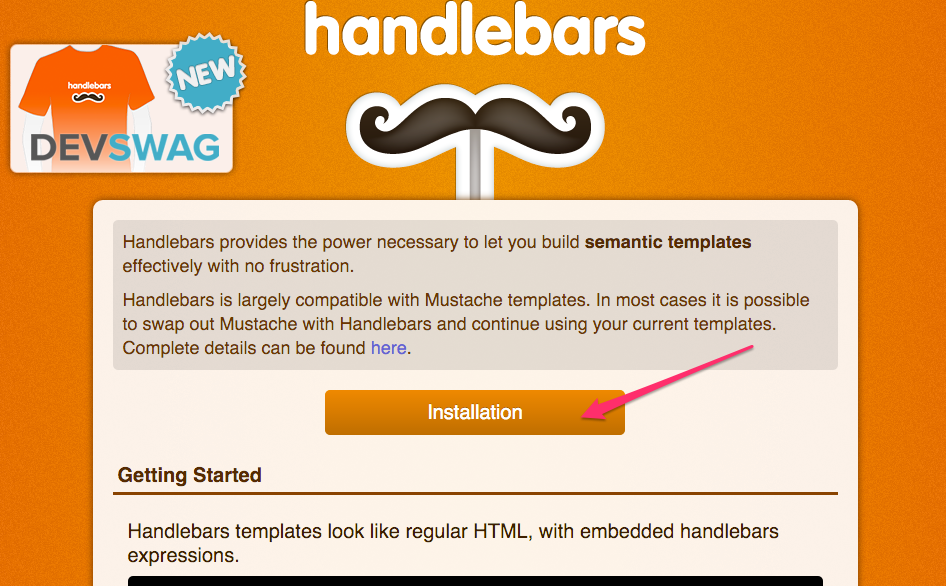
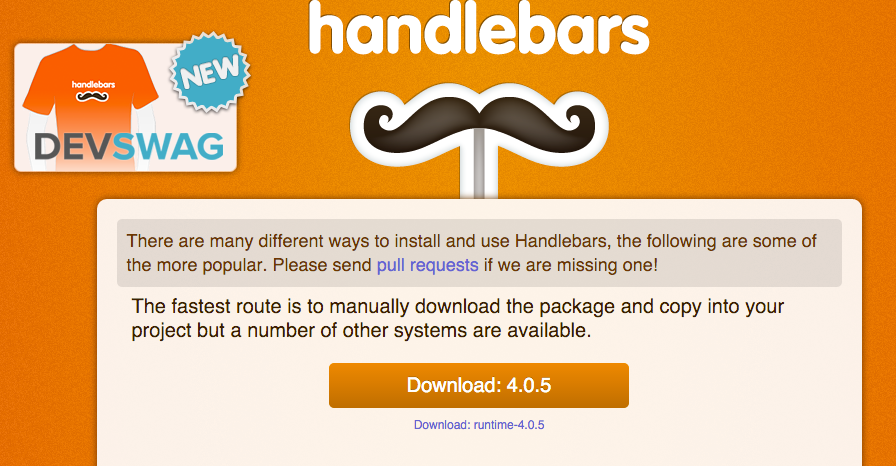
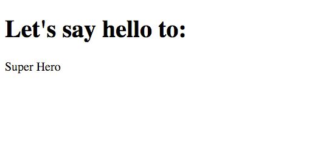

## How to set up handlebars for a project

+ Go to [Handlebarsjs js](http://handlebarsjs.com/) , and click the installation button.



+ Now, download the latest version:




+ Once you have the ```handlebars-v2.0.0.js``` file, all you have to do is to include the library in your ```html``` with a regular ``<script>`` tag.

```html
<script src="handlebars-v2.0.0.js"></script>
```


## Tutorial :trollface:

**I.** Create simple ```index.html``` file and add the following:

```html
<!DOCTYPE html>
<html>
    <head>
        <meta charset="utf-8">
        <title>Handlebar Tutorial</title>
    </head>
    <body>
        <h1>Let's say hello to:</h1>
    </body>
</html>
```

Remember to add the ```handlebars.js``` library in your ```index.html```file:

```html
<script src="handlebars-v2.0.0.js"></script>
```

**II.** Now we add the following ```<script>``` at the bottom of the ```index.html``` file:

```html
<script id="person-template" type="text/x-handlebars-template">
    <p class="person">{{firstmane}} {{lastname}}</p>
</script>
```


The template is bounded by ```<script>```tag of type ```text/x-handlebars-template```. So the browser will not display its contents during normal rendering.

We gave the script tag an arbritary id of ```person-template```because we will need to access its content later.

**III.** Now we need add our own ```JavaScript``` which we can wrap in an ```onload``` event to ensure that our ```JavaScript``` runs only after everything is loaded:

```javascript
window.onload = function () {

}
```

**IV.** We access our handlebars template via the ```person-template``` id and get the ```innerHTML``` into the source JavaScript variable:

```javascript
    var source = document.getElementById("person-template").innerHTML;
```

**V.** We call Handlebars to compile the source into a template:

```javascript
    var template = Handlebars.compile(source);
```

**VI.** We set some data in the context:

```javascript
    var context = {firstname: "John", lastname: "Doe"};
```

**VII.** We pass the context to the template to get an output:
```javascript
    var output = template(context);
```

**VIII.** Finally we place that output into our HTML:

```HTML
    <div id="nameoutput"></div>
```

and the following into our ```JavaScript``` ```<script>```tag:

```javascript
    document.getElementById("nameoutput").innerHTML = output;
```

**IX.** This is what you should see in your browser:


To learn more about this tutorial click [here](http://learnwebtutorials.com/step-by-step-getting-started-tutorial-using-handlebars-js).

#### Further learning
+ [Learn Handlebars in 10 minutes](http://tutorialzine.com/2015/01/learn-handlebars-in-10-minutes/)
+ [An introduction to Handlebars](http://code.tutsplus.com/tutorials/an-introduction-to-handlebars--net-27761)
+ [Handlerbars js tutorial](http://javascriptissexy.com/handlebars-js-tutorial-learn-everything-about-handlebars-js-javascript-templating/)
