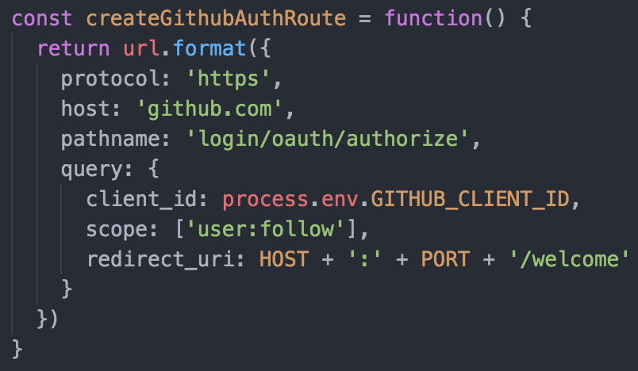
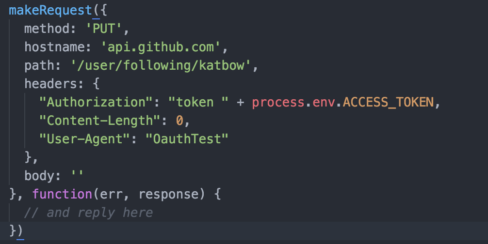

# Setting Scope and Using Access Tokens

## Scope
The OAuth specification permits the client to specify the permissions scope of the access request using the `scope` request parameter. This determines what actions the client will be able to perform with the access token; for example, some apps on Facebook request access only to public data, while others may request access to friends list or messages.

The value of the `scope` parameter is a comma-separated list of case sensitive strings. The valid members or this list are defined by the authorization server, which is free to partially or fully ignore the scope requested by the client.

If the authorization server receives a request without a `scope` it may either process the request with a pre-defined default scope or fails the request.

## Access Tokens
The client makes a request for an access token to the token endpoint with the following required parameters:

* `grant-type` - A value set to "authorization_code"
* `code` - The authorization code previously received from the server
* `redirect_uri` - this must match the `redirect_uri` from the authorization request
* `client_id` - duh

** Note: the Github API does not require a `grant-type` parameter, because you must use a specific endpoint for requesting the authorization code **

When the access token request is valid and authorized, the authorization server issues an access token in the response. If the request failed or is invalid, then the authorization server responds with an HTTP 400 status code.

# Tutorial
We will be modifying the OAuth walkthrough from yesterday, so I hope you all have it saved still! (If not, I've included the `server.js` file in this directory).

Our aim will be to follow a user using an API request.

It may be necessary to revoke permissions from your user account for the app you created.

First we will modify our initial authorization request to github to request specific permissions. You can find the full list of supported scope values [here](https://developer.github.com/v3/oauth/#scopes). We will request the `user:follow` permissions.

Next we will need to make a request to the Github API to follow a user. It's up to you if you do this by including a route for following a user or just make a request inside `/welcome`.

We are going to try following 'eliascodes' or 'katbow'! The API specifications we need for the end point are [here](https://developer.github.com/v3/users/followers/#follow-a-user), but we've given you the code you need below:

**Note: The User-Agent header is REQUIRED, and must be set either to your app name, or the authenticated username.**

We use our access token with process.env.ACCESS_TOKEN because we've saved it as an environment variable.

We can reply with whatever we like, since the response from the Github API will be empty unless there is an error.

To test if the request has worked, we can go to the profile page of the authenticated user and look at who they're following.

Happy following!

# References
Here are some useful links:
* [Full IETF specification of the OAuth protocol](https://tools.ietf.org/html/rfc6749)
* [Section of the IETF spec relevant to our "typical" workflow](https://tools.ietf.org/html/rfc6749#section-4.1)
* [Section on access token scope](https://tools.ietf.org/html/rfc6749#section-3.3)
* [Section on access token request](https://tools.ietf.org/html/rfc6749#section-4.1.3)
* [Section on access token response](https://tools.ietf.org/html/rfc6749#section-4.1.4)
